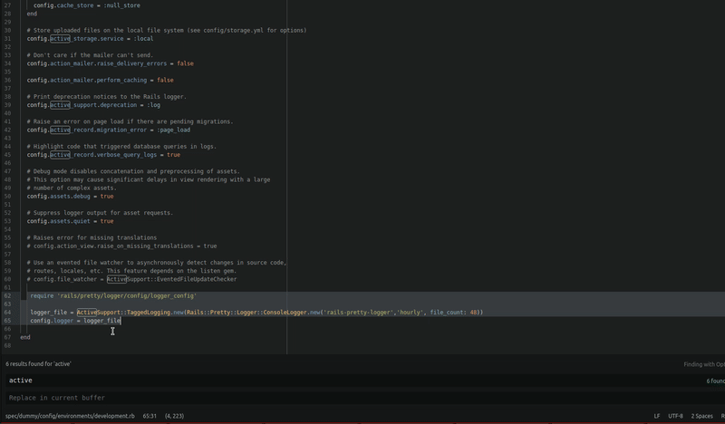

# Rails::Pretty::Logger
Pretty Logger is a logging framework which helps for checking  logs from page, with PrettyLogger.highlight method you can easily spot what you seek.If you want to perform hourly log rotation  Override logger class with Pretty logger, with file_count parameter kept files can be limited as you wish.

## Usage
visit http://your-webpage/rails-pretty-logger/dashboards/ then choose your log file, search with date range.


#### How to use debug Highlighter

```
PrettyLogger.highlight("lorem ipsum")
```


#### Use Hourly Log Rotation

Add these lines below to environment config file which you want to override its logger, first argument for name of the log file, second argument for keeping hourly logs, file count for limiting the logs files.

Rails::Pretty::Logger::ConsoleLogger.new("rails-pretty-logger", "hourly", file_count: 48)

```  
#/config/environments/development.rb

require "rails/pretty/logger/config/logger_config"

logger_file = ActiveSupport::TaggedLogging.new(Rails::Pretty::Logger::ConsoleLogger.new("rails-pretty-logger", "hourly", file_count: 48))
config.logger = logger_file
```   


#### Split your old logs by hourly

If you want split your old log files by hourly you can use this rake task below at terminal

argument takes what will be new files names start with, and with the second one will take the full path of your log file which will be splitted

for bash usage ```rake app:split_log["new_log_file_name","/path/to/your/log.file"]```

for zch usage  ```noglob rake app:split_log["new_log_file_name","/path/to/your/log.file"]```

## Installation
Add this line to your application's Gemfile:

```
gem 'rails-pretty-logger'
```

And then execute:
```bash
$ bundle
```

Or install it yourself as:
```bash
$ gem install rails-pretty-logger
```
Mount the engine in your config/routes.rb:

```
mount Rails::Pretty::Logger::Engine => "/rails-pretty-logger"
```

## Contributing

1. [Fork][fork] the [official repository][repo].
2. [Create a topic branch.][branch]
3. Implement your feature or bug fix.
4. Add, commit, and push your changes.
5. [Submit a pull request.][pr]

## License
The gem is available as open source under the terms of the [MIT License](https://opensource.org/licenses/MIT).


[repo]: https://github.com/kekik/rails-pretty-logger/tree/master
[fork]: https://help.github.com/articles/fork-a-repo/
[branch]: https://help.github.com/articles/creating-and-deleting-branches-within-your-repository/
[pr]: https://help.github.com/articles/using-pull-requests/
